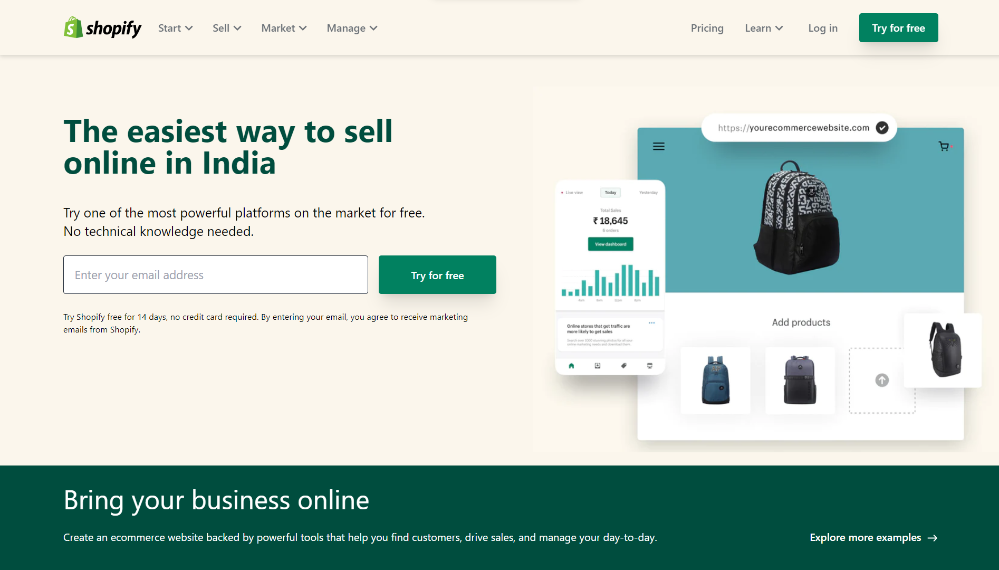
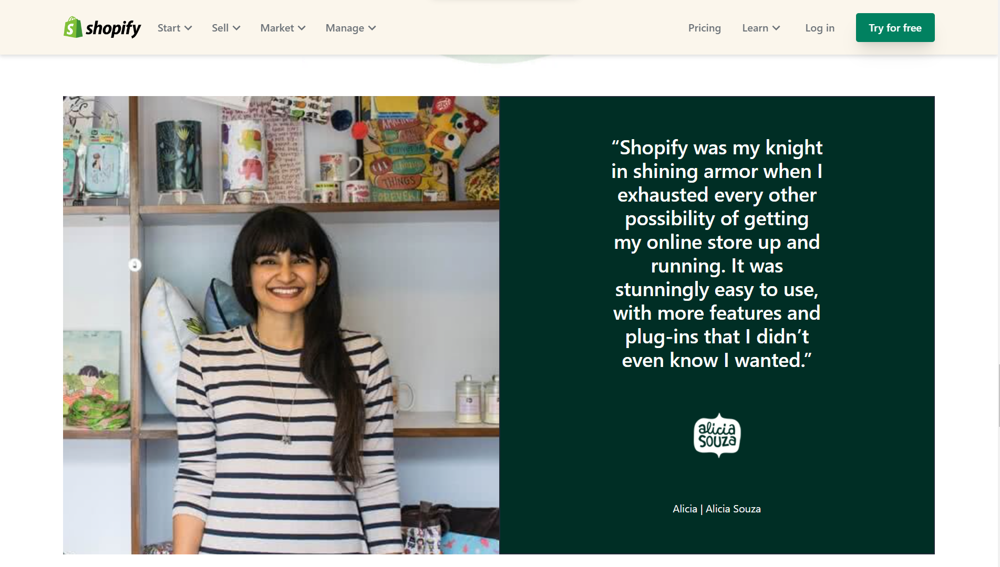
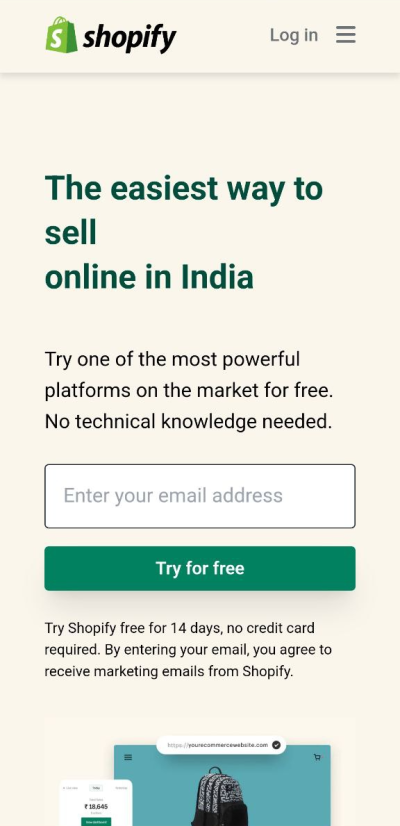
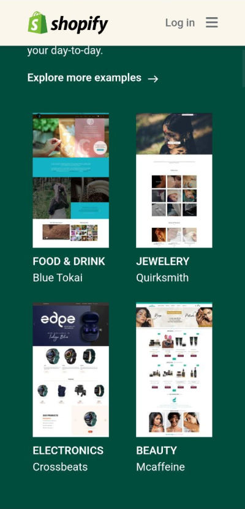

# Shopify Clone 

**Name :**  Shivam Sharma

**Time taken :**  12 hrs

This is the First tailwind project of FSJS Bootcamp, and it is a clone of the Shopify India website. It is designed using HTML, CSS, and Tailwind CSS 

**Key learning :** 

- Tailwind is a utility-first framework, it is best to start with small screen sizes while developing a website before moving on to larger ones.
- Placing several components at various breakpoints
- There are various ways to complete a particular task.

**Technology Used :**

**Deployed On :** 

## **Screenshots :**

### **Web Version :-**

&nbsp;

&nbsp;

&nbsp;
&nbsp;

### **Mobile Version :-**

&nbsp;

&nbsp;

&nbsp;

&nbsp;

## **🔗 Links**

